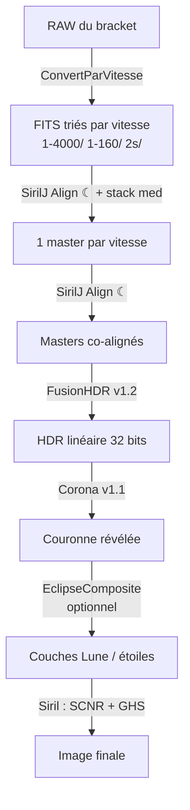

# Procédure complète — éclipse totale, du RAW à l'image finale

**Chaîne Siril + scripts Python**, de la conversion des RAW jusqu'à l'étirement final.

> ⚠️ **Sécurité** — en dehors de la totalité, filtre solaire certifié sur l'optique et
> lunettes ISO 12312-2 pour les yeux, en permanence. Voir la section sécurité du
> [Guide Eclipse HDR](Guide_Eclipse_HDR_FR.md), à lire **avant** le jour J.

---

## Vue d'ensemble



| Phase | Outil | Entrée → Sortie |
|---|---|---|
| 1 | `ConvertParVitesse.py` | RAW → FITS triés par vitesse |
| 2 | `SirilJ_Align.py` (☾) + Siril `stack` | Sous-poses → 1 master par vitesse |
| 3 | `SirilJ_Align.py` (☾) | Masters → masters co-alignés |
| 4 | `FusionHDR_v1.2.py` | Masters → HDR linéaire |
| 5 | `Corona_v1.1.py` | HDR → couronne révélée |
| 6 | `EclipseComposite.py` *(option)* | + Lune, protubérances, étoiles |
| 7 | Siril | SCNR, débruitage, GHS → image finale |

---

## Phase 0 — Préparation

### Prérequis

- **Siril 1.3+** avec le support des scripts Python (`sirilpy`).
  *Les commandes de ce guide ont été vérifiées sur **Siril 1.4.4**.*
- Les scripts dans le dossier de scripts de Siril (`~/siril/scripts/`).
- **`exiftool`** si vous shootez en **CR3** (Canon R5/R6/R7…) ou autre conteneur récent :
  ```bash
  brew install exiftool
  ```
  Sans lui, `exifread` couvre déjà CR2, NEF, ARW, DNG, ORF, RAF…

### Passer Siril en 32 bits — **indispensable**

Dans la console Siril :

```
set32bits
```

**Pourquoi c'est critique :** la couronne externe vaut environ 10⁻³ de la pleine échelle.
En 16 bits, il ne lui reste que ~65 niveaux → après étirement, des **terrasses** apparaissent
le long des isophotes (anneaux concentriques). En 32 bits flottant : continu.

Ce réglage doit être actif **avant l'empilement** (phase 2) — c'est là qu'il se joue.

### Arborescence de départ

```
totalité/
  raw/          ← déposez ici tous vos RAW
```

---

## Phase 1 — Conversion et tri par vitesse

**Outil : `ConvertParVitesse.py`**

Chaque niveau d'exposition doit être aligné et empilé **séparément**. Première étape :
séparer les poses par temps d'exposition.

1. Lancez le script depuis Siril.
2. **Dossier RAW** : `totalité/raw` — **Sortie** : `totalité`.
3. **🔍 Analyser les RAW** : lit les EXIF sans rien convertir, et affiche le plan de rangement.
4. Cochez les vitesses à traiter (décochez pour ne prendre qu'une partie — les diamants
   par exemple).
5. **▶ Convertir la sélection**.

| Réglage | Valeur | Note |
|---|---|---|
| Tolérance | **3 %** | fusionne les arrondis APEX (1/1000 vs 1/1024) sans mélanger deux crans de ⅓ de diaph |
| Dématriçage | **coché** | `convert -debayer` |
| Mise en place | **Lien** | les RAW ne sont ni copiés ni déplacés (économise des dizaines de Go) |
| Passer en 32 bits | décoché | inutile ici (RAW 14 bits) ; à activer avant la phase 2 |

**Résultat :**

```
totalité/
  raw/
  1-4000/   ← FITS dématriçés + séquence
  1-1000/
  1-160/
  2s/
```

> 💡 Si des poses ressortent « inconnues », c'est la lecture EXIF : installez `exiftool`.

---

## Phase 2 — Alignement et empilement, vitesse par vitesse

**Outils : `SirilJ_Align.py` (mode ☾ Éclipse) puis `stack` de Siril**

### Pourquoi aligner sur la Lune ici

C'est **l'étape la plus importante de toute la chaîne** pour la qualité du limbe.

Pendant l'acquisition d'un même niveau, la Lune **avance**. Si vous empilez les sous-poses
sans les recaler sur elle, chaque master mélange « protubérance au début » et « Lune noire
à la fin » → une **morsure sombre définitive** dans le master. Aucune fusion en aval ne
peut la rattraper : l'information est détruite.

### Pour chaque dossier de vitesse

1. Dans Siril, ouvrez la séquence du dossier (ex. `1-160/`).
2. Lancez **`SirilJ_Align.py`** → mode **☾ Éclipse — Lune (inter-poses)**.
   La séquence courante se charge automatiquement.
3. **↻ Détecter la Lune (toutes)**, puis vérifiez les cercles bleus (surtout sur les
   confiances orange/rouge). Corrigez au clic-glissé si besoin.
4. **▶ Aligner sur la Lune** → produit `aligned_*.fit` + `aligned_.seq`.
5. Empilez dans la console Siril — voir la configuration détaillée ci-dessous, par exemple
   pour 4 à 6 poses :

   ```
   stack aligned_ rej p 0.2 0.1 -nonorm -32b -out=master_1-160
   ```

### Configuration d'empilement recommandée

> Syntaxe vérifiée sur **Siril 1.4.4** :
> ```
> stack seqfilename { sum | min | max } [-output_norm] [-out=] [-maximize] [-upscale] [-32b]
> stack seqfilename { med | median } [-nonorm|-norm=] [-fastnorm] [-rgb_equal] [-output_norm] [-out=] [-32b]
> stack seqfilename { rej | mean } [type] [sigma_bas sigma_haut] [-rejmap] [-nonorm|-norm=] …
> ```
> Types de rejet : `n`(aucun) `p`(percentile) `s`(sigma) `m`(médiane) `w`(Winsorized,
> défaut) `l`(ajustement linéaire) `g`(GESDT) `a`(k-MAD).

**Choisissez selon le nombre d'images par vitesse** (c'est le seul critère qui compte ici) :

| Images / vitesse | Méthode | Commande |
|---|---|---|
| **2 – 3** | médiane | `stack aligned_ med -nonorm -32b -out=master_1-160` |
| **4 – 6** | rejet percentile | `stack aligned_ rej p 0.2 0.1 -nonorm -32b -out=master_1-160` |
| **7 et plus** | rejet Winsorized | `stack aligned_ rej w 3 3 -nonorm -32b -out=master_1-160` |

Le percentile est l'algorithme prévu pour les petits lots (≤ 6 images) ; au-delà, le
Winsorized est plus robuste sur les valeurs aberrantes (rayons cosmiques, pixels chauds,
avion ou satellite qui traverse).

### Les trois règles à ne pas enfreindre

1. **`-nonorm` est obligatoire.** Toute normalisation à l'empilement casse la relation
   radiométrique (valeur ∝ temps de pose × luminance) sur laquelle repose toute la fusion
   HDR. Sans lui : des paliers impossibles à corriger ensuite.

2. **Jamais `sum`.** L'empilement additif multiplie l'échelle du master par le nombre
   d'images — et vos vitesses n'ont pas forcément le même nombre de poses. Les masters
   seraient alors dans des échelles incohérentes entre eux. `med` et `rej`/`mean`
   retournent une **moyenne** : même échelle qu'une pose unique, donc l'`EXPTIME` de
   l'en-tête garde son sens. (Au passage, `sum` n'accepte même pas `-nonorm`.)

3. **Jamais `-maximize` ni `-upscale`.** Ils changent les dimensions de sortie ; les
   masters n'auraient plus tous le même cadre et FusionHDR refuserait la fusion
   (« Dimensions différentes »).

### Options utiles / à éviter

| Option | Verdict | Pourquoi |
|---|---|---|
| `-nonorm` | ✅ **toujours** | préserve la radiométrie |
| `-32b` | ✅ **toujours** | force la sortie en 32 bits, même si `set32bits` a été oublié |
| `-out=master_<vitesse>` | ✅ | nommage clair pour la phase 3 |
| `-rejmap` | 💡 diagnostic | écrit la carte des pixels rejetés — **vérifiez que vos protubérances n'y figurent pas** |
| `-output_norm` | ❌ | renormalise chaque master **indépendamment** → détruit le rapport d'échelle entre vitesses |
| `-rgb_equal` | ❌ | égalise les fonds RVB par master → dérive de couleur d'un master à l'autre |
| `-weight=…` | ❌ | inutile (toutes les poses d'un niveau ont la même exposition) et modifie l'échelle effective |
| `-norm=…`, `-fastnorm` | ❌ | voir règle 1 |
| `-filter-…` | — | inopérant : nos séquences n'ont pas de données de qualité issues de la registration Siril. Écartez les poses ratées à la main dans la séquence |

> 💡 **Vérification rapide du résultat :** les masters doivent être d'autant plus brillants
> que la pose est longue, dans le rapport des temps de pose. Chargez-en deux et comparez
> une même zone non saturée de la couronne : si le rapport des valeurs ne colle pas au
> rapport des `EXPTIME`, c'est qu'une normalisation s'est glissée quelque part.

Répétez pour chaque vitesse. Rassemblez les masters dans un dossier `masters/`.

---

## Phase 3 — Co-alignement des masters

**Outil : `SirilJ_Align.py` (mode ☾ Éclipse)**

Les masters de vitesses différentes ne sont pas cadrés pareil. Il faut les recaler entre
eux — et le seul repère commun entre une pose « diamant » et une pose « couronne pleine »
est le **disque lunaire** (la corrélation classique de Siril échoue : le contenu diffère
trop d'un niveau à l'autre).

1. `SirilJ_Align.py` → mode **☾ Éclipse**.
2. **Ajouter → FITS** : sélectionnez tous les masters.
3. **↻ Détecter la Lune (toutes)** — la détection s'adapte automatiquement
   (centroïde du disque enclos pour les poses lumineuses, ajustement de limbe par RANSAC
   pour le diamant).
4. Vérifiez chaque cercle. Astuce : réglez un centre parfait sur une pose nette, puis
   **⊕ Appliquer le centre affiché à toutes les poses** (la Lune bouge à peine entre les
   niveaux d'un même bracket).
5. **▶ Aligner sur la Lune**.

**Résultat :** `aligned_00001.fit …` — échelle relative et `EXPTIME` préservés dans les
en-têtes, ce dont FusionHDR a besoin.

---

## Phase 4 — Fusion HDR

**Outil : `FusionHDR_v1.2.py`**

1. **Ajouter → FITS** (ou Dossier) : les masters co-alignés. Les temps de pose sont lus
   automatiquement dans les en-têtes — vérifiez la colonne *Expo (s)*.
2. **Mode : Zones non saturées (spatial)** (défaut).
3. **▶ Fusionner**, puis **Enregistrer + charger dans Siril**
   (`hdr_merge.fit` dans le dossier de travail de Siril, chargé en 32 bits).

### Réglages

| Réglage | Défaut | Rôle |
|---|---|---|
| Seuil saturation | **0,85** | on fusionne sous le coude non linéaire du capteur |
| Transition | **0,20** | zone de mélange en intensité (autres modes) |
| Marge zone saturée | **20 px** | la saturation contamine son voisinage (bavure, halo) |
| Fondu spatial | **20 px** | rampe sur la **distance** au masque, pas sur l'intensité |
| Protubérances : superposition sans halo | **coché**, N = **3** | union des protubérances de N poses courtes |
| Limbe mono-pose | **coché** | la bande du limbe vient d'une seule époque |
| Coude hautes lumières | **0,85** | compression douce au lieu de l'écrêtage → le cœur garde son modelé |
| Calibration croisée | **coché** | recale gain + offset entre poses (anti-paliers) |

### Ce que fait le mode « Zones »

Le relais entre poses se fait sur la **distance aux zones saturées**, donc **loin de la
saturation, en pleine zone linéaire** où les poses concordent → plus de marche le long des
isophotes. Les protubérances sont ensuite **superposées sans leur halo** : de chaque pose
courte, seuls les excès localisés au-dessus de la ligne de base azimutale sont extraits,
puis on prend l'**union** des N époques (aucune protubérance n'est érodée, aucun halo mélangé).

### À surveiller dans le journal

- ⚠ **« Poses en entiers 8/16 bits détectées »** → refaites la phase 2 avec `set32bits`.
- Les **cercles lunaires détectés par pose** : si les centres bougent de plusieurs pixels,
  la dérive lunaire est réelle (normal, elle est gérée).
- « Protubérances : union de 3 pose(s) courte(s), N px ajoutés (sans halo) ».

---

## Phase 5 — Rehaussement de la couronne

**Outil : `Corona_v1.1.py`**

Quatre méthodes. **Le choix dépend du rapport signal/bruit de votre champ externe.**

| Méthode | Principe | Quand l'utiliser |
|---|---|---|
| **Détail tangentiel (ACHF)** | flou le long des arcs, soustrait → seules les structures **radiales** ressortent | **champ externe bruité** — n'amplifie que ce qui dépasse le plancher de bruit |
| **RHEF** | égalisation d'histogramme par anneau, sans réglage | champ à bon SNR, jusqu'au bord |
| **FNRGF** | (I − moyenne)/σ par séries de Fourier azimutales | idem, avec un ordre réglable |
| **MGN** | normalisation locale multi-échelle | sans centre ni masque |

> **Retour de terrain :** sur des poses où la couronne externe est noyée dans le bruit,
> RHEF et FNRGF **étirent ce bruit à plein contraste** (résultat inexploitable) et MGN
> amplifie le grain. Dans ce cas, **le détail tangentiel est le seul exploitable** — il
> préserve la tonalité du HDR (fond sombre) et part tel quel au GHS.

### Marche à suivre (détail tangentiel)

1. Le HDR est déjà chargé dans Siril → **⟳ Image Siril**
   (ou **Fichier…** pour ouvrir `hdr_merge.fit` directement).
2. **◎ Détecter le centre**, puis **vérifiez le cercle bleu au limbe** — zoomez.
   Corrigez au clic-glissé (centre) et Maj+molette (rayon) : un rayon trop grand mange
   la couronne interne.
3. **Rayon max couronne** : Ctrl+molette jusqu'à ce que le cercle ambré pointillé englobe
   juste la couronne visible → les coins bruités passent en noir.
4. Méthode **Détail tangentiel (ACHF)**, arc **8°**, force **1,0–2,0**.
5. **▶ Appliquer**, puis **Enregistrer + charger dans Siril**.

> 💡 Combinaison possible si le SNR le permet : **RHEF** (aplatir) → enregistrer → recharger
> → **Détail tangentiel** (affûter) → GHS.

---

## Phase 6 — Composite *(optionnel, expérimental)*

**Outil : `EclipseComposite.py`**

Ajoute au HDR des couches issues des poses alignées. C'est une composition **assumée comme
esthétique**, plus radiométrique.

| Couche | Source | Réglages clés |
|---|---|---|
| ☾ **Lune** (clair de Terre) | médiane des N poses longues | N = 3, *Retirer le halo interne* coché, niveau 3 % |
| 🔥 **Protubérances** | poses courtes | **épaisseur d'anneau 4 px**, saturation couleur **×2** |
| ✶ **Étoiles** | poses longues, hors couronne | seuil 6σ, rayon min 2,5 × R, confirmation croisée |

Deux points de terrain :

- **Épaisseur d'anneau = 4 px.** Avec un anneau large, les racines des streamers sont
  elles aussi des « excès au-dessus de la médiane azimutale » et se font booster comme de
  fausses protubérances.
- **Saturation couleur ×2** : le GHS écrase la chrominance près du blanc ; sans
  pré-amplification, le rose des éruptions disparaît à l'étirement.

> Si la superposition sans halo de FusionHDR v1.2 (phase 4) vous convient déjà, la couche
> protubérances du composite fait double emploi — ne gardez que la Lune et/ou les étoiles.

---

## Phase 7 — Finition dans Siril

1. **Vert résiduel** — les capteurs Bayer donnent une dominante verte à la couronne :
   ```
   rmgreen
   ```
   (SCNR, *Suppression du bruit chromatique vert*).

2. **Débruitage** *(optionnel, sur données linéaires)* — plus efficace **avant** l'étirement :
   ```
   denoise
   ```

3. **GHS — Generalized Hyperbolic Stretch** : c'est l'étirement tonal final.

   > **Choisissez le mode luminance / préservation des couleurs**, pas « canaux
   > indépendants » : ce dernier blanchit le limbe et fait disparaître les protubérances
   > roses.

   Procédez par petits incréments successifs plutôt qu'un seul étirement violent.

4. **Saturation** — un coup de saturation après l'étirement finit de faire ressortir les
   protubérances et les nuances de la couronne.

5. Export : `savetif`, `savejpg`, ou *Fichier → Enregistrer sous*.

---

## Récapitulatif des réglages

| Étape | Réglage | Valeur |
|---|---|---|
| Siril | Profondeur | **32 bits** (`set32bits`) |
| ConvertParVitesse | Tolérance / dématriçage | 3 % / coché |
| Empilement (phase 2) | 2–3 images | `med -nonorm -32b` |
| | 4–6 images | `rej p 0.2 0.1 -nonorm -32b` |
| | 7 images et + | `rej w 3 3 -nonorm -32b` |
| | À proscrire | `sum`, `-output_norm`, `-rgb_equal`, `-maximize` |
| FusionHDR v1.2 | Mode | Zones non saturées |
| | Seuil saturation / transition | 0,85 / 0,20 |
| | Marge / fondu spatial | 20 px / 20 px |
| | Protubérances (union N) | coché, N = 3 |
| | Coude hautes lumières | 0,85 |
| Corona v1.1 | Méthode (champ bruité) | Détail tangentiel, arc 8°, force 1–2 |
| | Rayon max couronne | réglé au cercle ambré |
| EclipseComposite | Anneau protubérances | **4 px**, saturation ×2 |
| Siril | Étirement | GHS **mode luminance** |

---

## Dépannage

| Symptôme | Cause | Correctif |
|---|---|---|
| **Taches noires au limbe** | la Lune a dérivé pendant l'empilement d'un niveau → morsure figée dans le master | **Phase 2** : réaligner sur la Lune *avant* d'empiler. C'est le seul vrai correctif |
| **Paliers / niveaux concentriques** | poses discordantes (EXIF arrondis, capteur non linéaire, ciel variable) | mode **Zones**, calibration croisée, marge 20 → 40 px |
| **Terrasses dans la couronne faible** | chaîne en 16 bits | `set32bits` **avant** l'empilement, puis tout refaire depuis la phase 2 |
| **Cœur cramé, sans modelé** | écrêtage dur en sortie | **Coude** 0,85 → 0,70 |
| **Image toute blanche dans Siril** | masters 16 bits enregistrés en flottant > 1 | géré par SirilJ Align (division par un facteur commun) |
| **Coins bruités après Corona** | égalisation d'un champ sans signal | **Rayon max couronne**, ou méthode Détail tangentiel |
| **Rendu « marbré », fond gris** | RHEF/FNRGF sur un champ dominé par le bruit | passer au **Détail tangentiel** |
| **Protubérances qui disparaissent au stretch** | le GHS écrase la chrominance | GHS **mode luminance** + saturation ×2 dans le composite |
| **Couronne proche « amplifiée »** | corrigé en v1.2 (potentiel anti-trous) | vérifier qu'on utilise bien `FusionHDR_v1.2.py` |
| **« Directory not found » dans Siril** | chemin contenant des espaces | corrigé (chemins entre guillemets) partout |

---

## Notes et limites

- **Les scripts en `_v1.1` / `_v1.2` sont des variantes expérimentales** conservées à côté
  des originaux (`FusionHDR.py`, `Corona.py`), qui restent inchangés. Vous pouvez comparer
  les deux sur les mêmes données.
- **EclipseComposite est en v0.1** — les niveaux sont à ajuster à l'œil, il n'y a pas de
  vérité radiométrique.
- Une image ne peut pas révéler ce qui n'a pas été enregistré : si le cœur de la couronne
  est déjà saturé jusque dans votre pose la plus courte, aucun réglage ne le récupérera.
  Idem pour les morsures figées dans un master.

### Pour la prochaine éclipse — prise de vue

- **ISO et ouverture fixes**, ne faire varier que la vitesse. Changer l'ISO change le gain
  et la non-linéarité → paliers garantis à la fusion.
- **3 à 5 images par palier**, balayage 1/4000 s → 2 s par pas de 1 EV, répété tant que
  dure la totalité.
- Chaque niveau en **rafales rapprochées dans le temps** (et non étalé sur toute la
  totalité) : c'est la parade à la racine contre les morsures lunaires.
- **RAW**, réduction de bruit pose longue **désactivée**, obturateur électronique,
  mise au point scotchée.
- **Des flats** avec le montage exact — ils élimineront le vignettage qu'on voit sinon
  dans les coins.
- Protubérances : rafales **très courtes (1/1000–1/4000)** juste après C2 et juste avant C3.
- Lumière cendrée / étoiles : poses de **1–4 s au milieu de la totalité**, cadrées avec de
  la marge autour de la couronne.

---

# Annexe — effet de chaque réglage

Référence champ par champ, écran par écran. Pour chaque réglage : sa valeur par défaut,
sa plage, et **ce qui change si vous l'augmentez ou le diminuez**.

> Convention : ⬆ = effet quand on **augmente** la valeur, ⬇ = quand on la **diminue**.
> Les valeurs marquées **⚠** sont celles qui cassent quelque chose si on les touche à la légère.

---

## A1 — ConvertParVitesse

### Dossiers

| Champ | Défaut | Effet |
|---|---|---|
| **RAW** | `<dossier Siril>/raw` | Dossier scanné. Seuls les fichiers d'extension reconnue sont lus ; les sous-dossiers sont ignorés. |
| **Sortie** | dossier parent des RAW | Où sont créés les sous-dossiers par vitesse. Le pointer sur un dossier contenant déjà des FITS déclenche le garde-fou (groupe ignoré). |

### Regroupement

| Champ | Défaut | Plage | Effet |
|---|---|---|---|
| **Tolérance (%)** | 3,0 | 0–25 | Écart relatif sous lequel deux poses vont dans le même groupe. ⬆ fusionne des vitesses distinctes (à 26 % on mélange deux crans de ⅓ de diaph) ; ⬇ à 0 sépare `1/1000` et `1/1024`, qui sont pourtant la même vitesse arrondie par le boîtier. |
| **Préfixe séquence** | *(vide)* | — | Nom de base des FITS et de la séquence. Vide → `1-160_00001.fit`. Utile si un nom commençant par un chiffre gêne. |

### Conversion

| Champ | Défaut | Effet |
|---|---|---|
| **Dématriçage** | coché | Décoché, les FITS gardent la matrice de Bayer brute — inutilisable pour la suite de cette chaîne. |
| **Mise en place** | Lien | *Lien* : 0 octet, les RAW ne bougent pas. *Copie* : duplique les RAW (des dizaines de Go) — à réserver aux systèmes qui refusent les liens. |
| **Passer Siril en 32 bits** | décoché | ⬆ double la taille des FITS **sans gain** (les RAW sont en 14 bits). À activer **avant l'empilement**, pas ici. |
| **Vider le dossier cible** ⚠ | décoché | Supprime tous les `.fit/.fits/.seq` du sous-dossier. Sans lui, un groupe contenant des FITS étrangers est **ignoré** plutôt que corrompu. |

---

## A2 — SirilJ Align, mode ☼ Soleil

### Image de référence

| Champ | Défaut | Effet |
|---|---|---|
| **Mode** | Meilleure netteté | Détermine la géométrie finale de toute la série. *Meilleure netteté* analyse toutes les images (plus lent au départ, meilleur résultat). *Manuel* + **Index** si vous savez laquelle est la meilleure. |

### Alignement multi-points

| Champ | Défaut | Plage | Effet |
|---|---|---|---|
| **Correction locale** | coché | — | Décoché → translation globale seule : rapide, mais la turbulence n'est plus corrigée. |
| **Boîte (px)** | 128 | 48–384 | Taille du patch de mesure. ⬇ suit un détail plus fin mais devient instable sur le bruit ; ⬆ plus robuste, mais lisse la déformation et rate les variations rapides. |
| **Pas de grille (px)** | 64 | 16–256 | Espacement des points. ⬇ champ plus fin, calcul plus long (le temps croît en 1/pas²) ; ⬆ champ plus grossier. Garder ≈ moitié de la boîte. |
| **Décalage local max (px)** | 12 | 2–64 | Au-delà, le point est rejeté. ⬇ trop bas rejette de vrais décalages en forte turbulence ; ⬆ laisse passer des mesures aberrantes qui déforment l'image. |
| **Passes de raffinement** | 2 | 1–4 | ⬆ affine le champ (résidu ÷ ~1,3 par passe) sans flou supplémentaire — les cartes sont composées, l'image n'est rééchantillonnée **qu'une fois**. Coût : durée × N. |

### Sortie & intégration

| Champ | Défaut | Effet |
|---|---|---|
| **Préfixe** | `mp_` | Nom du sous-dossier isolé **et** de la séquence. L'isolement évite que `convert` mélange originaux et images alignées. |
| **Convertir / Empiler / Charger** | cochés | Enchaînent les commandes Siril. Décocher *Empiler* si vous préférez empiler à la main avec des options plus fines. |
| **Méthode** | `sum` | ⚠ Pour la chaîne éclipse, préférez **`med`** ou **`rej`** : `sum` multiplie l'échelle par le nombre d'images (voir phase 2). |

---

## A3 — SirilJ Align, mode ☾ Éclipse

| Champ | Défaut | Plage | Effet |
|---|---|---|---|
| **Rayon lunaire (px)** | médiane détectée | 0–20000 | Rayon du cercle de contrôle. N'influence **pas** l'alignement lui-même (qui n'utilise que le centre) : c'est une aide visuelle pour valider la détection. |
| **Verrouiller au rayon médian** | — | — | Impose le rayon médian à toutes les poses — utile quand quelques détections dérivent. |
| **⊕ Appliquer le centre à toutes** | — | — | Le geste le plus rentable : réglez un centre parfait sur une pose nette et propagez-le. La Lune bouge à peine dans un bracket. |
| **Dossier** | dossier des poses | — | Vide = à côté des poses. |
| **Créer aligned_.seq** | coché | — | Écrit la séquence directement : elle ne référence **que** les images alignées, même si d'autres FITS traînent. |

**Colonne Conf.** — confiance de détection : vert ≥ 0,15, orange ≥ 0,07, rouge en dessous.
Une valeur de 1,00 signifie disque sombre enclos détecté (le cas le plus sûr) ou centre posé
à la main. Contrôlez systématiquement les lignes orange et rouges.

---

## A4 — FusionHDR v1.2

### Fusion

| Champ | Défaut | Plage | Effet |
|---|---|---|---|
| **Mode** | Zones non saturées | — | *Zones* : masque de saturation + marge + fondu **spatial** (relais loin de la saturation). *Variance minimale* : pondération 1/variance, sans notion de zone. *Seuil* / *Pondéré* : modes historiques. *Mertens* : rendu tone-mappé, ignore les temps de pose. |
| **Pleine échelle** | Auto | — | Valeur considérée comme saturation matérielle. *Auto* = max des poses. Forcer *1.0* si vos FITS sont normalisés, *65535* s'ils sont en 16 bits bruts. |
| **Seuil saturation** | 0,85 | 0,50–1,0 | Fraction de la pleine échelle au-delà de laquelle un pixel est déclaré saturé. ⬇ fusionne plus bas dans la plage linéaire du capteur (moins de paliers) mais utilise moins de signal ; ⬆ conserve plus de signal mais capte le haut non linéaire. |
| **Transition (× éch.)** | 0,20 | 0–0,5 | Largeur du fondu **en intensité** (modes autres que *Zones*). ⬆ adoucit les raccords. |
| **Marge zone saturée (px)** | 20 | 0–500 | Exclusion étendue autour de chaque zone saturée — la saturation contamine son voisinage (bavure, halo, non-linéarité). ⬆ **le réglage clé contre les paliers** ; trop haut = plus de bruit aux raccords (on s'appuie sur moins de poses). |
| **Fondu spatial (px)** | 20 | 1–500 | Longueur de la rampe de poids sur la **distance** au masque. ⬆ transition plus douce ; ⬇ vers 1 recrée un bord franc. |
| **Protubérances : superposition sans halo** | coché | — | Extrait de chaque pose courte les seuls excès au-dessus de la ligne de base azimutale, puis en fait l'**union**. Décocher si vos protubérances sont déjà correctes. |
| **…union des N courtes** | 3 | 1–5 | Nombre de poses courtes dont les protubérances sont superposées. ⬆ couvre plusieurs époques (protubérances des deux bords) ; l'union n'érode rien, contrairement à une médiane. |
| **…hauteur (× rayon Lune)** ⚠ | 0,15 | 0,02–1,0 | Hauteur de la bande de recherche au-dessus du limbe. ⬆ **au-delà de ~0,3 la bande capte les streamers** (eux aussi des excès azimutaux) et rehausse toute la couronne interne. |
| **Limbe mono-pose** | décoché | — | Force la bande du limbe à provenir d'une seule pose. C'est une zone à règle différente : **sa frontière peut se voir comme un cercle**. Le masque lunaire continu la rend inutile dans la plupart des cas. |
| **Coude hautes lumières** | 0,85 | 0,50–1,0 | Compression douce au lieu de l'écrêtage. ⬇ protège davantage le cœur (0,70 pour un cœur très brillant) ; 1,00 = écrêtage dur (ancien comportement). Sans effet en *Mertens*. |

### Options

| Champ | Défaut | Effet |
|---|---|---|
| **Soustraire le fond** + **Percentile** | décoché / 5,0 | Pour le ciel profond. **À laisser décoché en éclipse** : la couronne n'a pas de « fond » à retirer. |
| **Normaliser la sortie à [0,1]** | coché | Sans effet quand toutes les poses partagent la même vitesse (l'échelle radiométrique est alors préservée volontairement). |
| **Calibration croisée (anti-bandes)** | coché | Recale gain + offset entre poses voisines. Se **désactive automatiquement** si l'écart médian dépasse ±25 % : ce n'est plus un résidu mais un temps de pose faux — le journal le dit. |

### Colonne « Expo (s) »

Saisie acceptée : `0.004`, `0,004`, `1/250`, `1/1000 s`, `2s`. Une saisie invalide est
**refusée avec un message** (et non silencieusement annulée). Ces valeurs pilotent toute la
radiométrie : une erreur ici se propage à tout le reste.

---

## A5 — Corona v1.1

### Méthode

| Méthode | Quand l'utiliser |
|---|---|
| **RHEF** | champ externe à bon SNR — sans aucun réglage |
| **FNRGF** | idem, avec un ordre réglable |
| **MGN** | normalisation locale, sans centre |
| **Détail tangentiel (ACHF)** | **champ externe bruité** — n'amplifie que ce qui dépasse le plancher de bruit, et préserve la tonalité du HDR |

### Centre — méthodes radiales

| Champ | Défaut | Effet |
|---|---|---|
| **Rayon lunaire (px)** | détecté | Tout ce qui est en deçà passe en noir. ⬆ trop grand **mange la couronne interne** ; ⬇ trop petit laisse un liseré de Lune. |
| **Rayon max couronne (px)** | 0 (aucune limite) | Au-delà, tout passe en noir — supprime les coins bruités. Réglez au `Ctrl+molette` jusqu'à ce que le cercle ambré englobe juste la couronne visible. |

### FNRGF

| Champ | Défaut | Plage | Effet |
|---|---|---|---|
| **Ordre Fourier** | 8 | 1–40 | Nombre d'harmoniques azimutales. ⬇ (2–4) grandes structures, rendu naturel ; ⬆ (12–20) très aplati, détail fin, supprime les lobes sombres. |
| **Lissage radial** | 8,0 | 1–200 | Lissage du profil radial. ⬆ profil plus doux, moins sensible au bruit ; ⬇ suit les variations fines au risque d'absorber de vraies structures. |

### Détail tangentiel

| Champ | Défaut | Plage | Effet |
|---|---|---|---|
| **Arc de flou (°)** | 8,0 | 1–45 | Longueur d'arc du flou circulaire. ⬇ détail radial fin ; ⬆ structures radiales larges. |
| **Force** | 1,0 | 0,1–5,0 | Amplitude du détail ajouté. ⬆ accentue les streamers ; au-delà de ~2–3 le rendu durcit. |

### MGN

| Champ | Défaut | Plage | Effet |
|---|---|---|---|
| **Échelles** | Standard | 3 choix | *Fin* = détail serré, *Large* = grandes structures. |
| **Contraste k** | 0,7 | 0,1–3,0 | ⬆ renforce le détail local (borné par l'arctan, donc jamais d'écrêtage). |
| **Gamma global** | 3,2 | 1–6 | Tonalité de la composante globale. Effet **faible** sur le cramage (mesuré : 3,3 → 4,7 %). |
| **Global ↔ détail (h)** | 0,7 | 0–1 | Dosage entre tonalité globale et détail. ⬇ privilégie le détail. Effet faible sur le cramage. |

### Commun

| Champ | Défaut | Plage | Effet |
|---|---|---|---|
| **Réduction du bruit** | 2,0 | 0–10 | Plancher de bruit (× σ estimé). ⬆ moins de grain dans les zones plates et le champ vide ; ⬇ vers 0 laisse le bruit s'amplifier. |
| **Coude hautes lumières** | 0,85 | 0,50–1,0 | **Le vrai levier contre la couronne cramée** : la sortie des filtres est bornée, seul cet étirement final écrête. Mesuré : 1,00 → 4,19 % de couronne interne cramée ; 0,85 → 0,80 % ; **0,75 → 0,00 %**. Sans effet en *Détail tangentiel*. |
| **Neutraliser la couronne** | 0,8 | 0–1 | Désature la couronne (blanche par nature) en préservant le rouge Hα. Maximise le **rapport** de saturation couronne/protubérances : 1,6× à 0 → 74× à 0,8. La saturation absolue se remonte ensuite d'un curseur. |
| **Retirer la dominante** | coché | — | Balance des blancs mesurée sur la couronne seule, pixels rouges exclus pour ne pas blanchir les protubérances. |
| **Disque lunaire au niveau du fond** | coché | — | Les méthodes radiales forcent le disque à noir pur ; au milieu d'un fond gris ce noir absolu devient le point le plus contrasté de l'image et capte le regard. Coché : la Lune est simplement silhouettée. Mesuré : contraste disque/fond 0,330 → 0,007. |
| **Préserver la couleur** | coché | — | Décoché → sortie monochrome (la nouvelle luminance seule). |

---

## A6 — EclipseComposite

### Disque lunaire

| Champ | Effet |
|---|---|
| **Rayon (px)** | Définit où s'arrête la couche Lune et où commence l'anneau des protubérances. Vérifiez-le au zoom : c'est lui qui cadre les deux couches. |

### ☾ Lune — clair de Terre

| Champ | Défaut | Plage | Effet |
|---|---|---|---|
| **Poses longues (N)** | 3 | 1–50 | Nombre de poses les plus longues empilées (médiane) pour le disque. ⬆ moins de bruit, mais mélange davantage d'époques. |
| **Retirer le halo interne** | coché | — | Retire la diffusion de la couronne qui déborde sur le bord du disque, en conservant le piédestal cendré et les mers. |
| **Niveau (% couronne)** | 3,0 | 0,1–50 | Luminosité du disque, en % de la couronne interne. ⬆ disque plus visible ; au-delà de ~10 % le rendu devient irréaliste. |
| **Plancher du disque (%)** | 0,0 | 0–5 | Relève le disque à un gris sombre uniforme. **N'invente aucun détail** — purement cosmétique — mais le disque cesse de lire comme un trou. 0,10–0,30 suffit. |
| **Ignorer si disque vide** | coché | — | Mesure la structure du disque face au bruit ; si les poses longues y sont noires, la couche est **passée** au lieu d'amplifier du grain. Le journal donne le SNR mesuré. |

### 🔥 Protubérances

| Champ | Défaut | Plage | Effet |
|---|---|---|---|
| **Poses courtes (N)** | 1 | 1–20 | Poses les plus courtes servant de source. |
| **Épaisseur anneau (px)** ⚠ | 4 | 2–2000 | **Fin (2–8) = protubérances du limbe seulement.** Large → les racines des streamers deviennent de fausses protubérances. |
| **Niveau (% couronne)** | 80 | 1–200 | Intensité ajoutée. |
| **Saturation couleur (×)** | 2,0 | 1–5 | Pré-amplifie la couleur pour qu'elle survive au GHS, qui écrase la chrominance près du blanc. ⬆ jusqu'à 3 si le rose disparaît encore. |
| **Sélectivité Hα (rouge)** | 0,7 | 0–1 | Ne rehausse que ce qui est réellement rouge. Rapport protubérances/streamers mesuré : 1,5× à 0 → **5,1× à 0,7**. C'est ce qui les fait ressortir dans une couronne brillante. |

> ⚠ **Ordre des opérations :** la purification du rouge est appliquée au détail **avant** la
> saturation. C'est essentiel — le renfort de saturation amplifie la teinte présente : sur un
> détail déjà un peu jaune (V ≈ R) il écrase le bleu et **fabrique** du jaune franc.
> Mesuré : teinte finale V/R = 0,81 (jaune) sans purification → **0,36 (rouge naturel) à 0,5**.

### ✶ Étoiles

| Champ | Défaut | Plage | Effet |
|---|---|---|---|
| **Seuil (σ)** | 6,0 | 3–20 | ⬇ détecte des étoiles plus faibles **et** des faux positifs ; ⬆ ne garde que les plus sûres. |
| **Rayon min (× R lune)** | 2,5 | 1,2–20 | En deçà, la couronne domine : aucune détection. ⬆ si la couronne est très étendue. |
| **Confirmation croisée** | coché | — | Exige la présence dans deux demi-empilements. Sur champ de bruit pur : **0 faux positif** dans les tests. |
| **Niveau (% couronne)** | 25 | 1–100 | Luminosité des étoiles rehaussées. |

### Couronne — couleur

| Champ | Défaut | Plage | Effet |
|---|---|---|---|
| **Neutraliser (Hα préservé)** | 0,8 | 0–1 | Comme dans Corona. **Si vous neutralisez déjà dans Corona, laissez à 0** pour ne pas désaturer deux fois. |
| **Retirer la dominante** | coché | — | Balance des blancs sur la couronne, pixels rouges exclus. Fonctionne même si *Neutraliser* vaut 0 (ce sont deux réglages indépendants). |
| **Rouge pur (retire le vert)** | 0,0 | 0–1 | Sur les pixels où le rouge domine le bleu, ramène le vert vers le bleu : le jaune/orange redevient rouge. Plus agressif que le SCNR de Siril, qui plafonne seulement le vert au niveau neutre. **0,5 donne un rouge naturel ; 1,0 est souvent trop franc.** |
| **Disque au niveau du fond** | coché | — | Garantie finale : si une couche a laissé le disque plus sombre que le fond de ciel, il y est ramené. Sans effet si Corona l'a déjà fait. |

---

## A7 — Réglages à ne pas toucher sans raison

| Réglage | Pourquoi |
|---|---|
| `stack … **-nonorm**` | Toute normalisation casse la relation valeur ∝ pose × luminance dont dépend toute la fusion. |
| FusionHDR — **hauteur des protubérances** > 0,3 | Capte les streamers et rehausse toute la couronne interne. |
| FusionHDR — **Soustraire le fond** en éclipse | La couronne n'a pas de fond à retirer ; l'activer ampute le signal faible. |
| Corona — **Rayon lunaire** trop grand | Mange la couronne interne, définitivement. |
| ConvertParVitesse — **Vider le dossier cible** | Destructif ; le garde-fou par défaut est plus sûr. |
