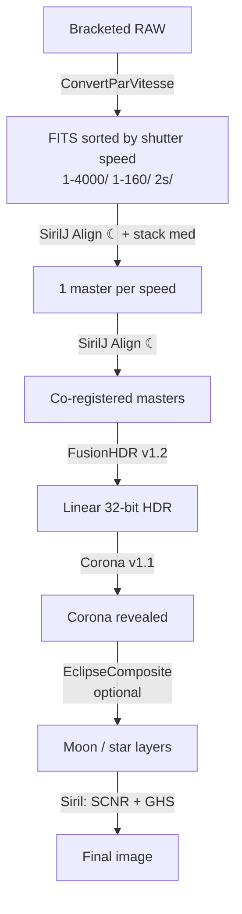

# Full procedure — total solar eclipse, from RAW to final image

**Siril + Python scripts**, from RAW conversion through to the final stretch.

## ⚠ Safety — eyes & gear (read first)

**Outside totality, the Sun is dangerous to both your eyes and your sensor.** The photosphere is visible during every partial phase (before C2, after C3): looking at it — or pointing an optic at it — without protection causes **irreversible, painless retinal burns**, and can destroy the sensor or start a fire.

| Phase | Eyes | Optics / camera |
|---|---|---|
| **Partial phases** (before C2, after C3) | **Certified ISO 12312-2 eclipse glasses** only. Never with the naked eye, nor through a viewfinder / binoculars / telescope without a filter. | **Certified solar filter** (e.g. Baader AstroSolar) **in front** of the lens, at all times. |
| **Totality** (between C2 and C3, **only**) | Naked-eye viewing **allowed** — the only safe moment. | Shooting **without a filter** allowed. |

- **At C2 / end of the diamond ring**: remove the filter **only** once Baily's beads and the diamond ring are gone and totality is fully established.
- **At C3 / reappearance of the diamond ring**: the photosphere returns **suddenly**. **Put the filter back and stop all direct viewing the instant the diamond ring reappears** — do not wait: a fraction of a second can injure.
- Know your precise **contact times (C2, C3)**, keep the filter **ready to refit**, and warn everyone present. When in doubt: **filter on**.

> Eclipse glasses protect **your eyes**, not the camera; the lens filter protects **the camera**, not your eyes if you look elsewhere. Both are required during the partial phases.

> The scripts' user interface is in French. This guide gives the English meaning of every
> control, with the on-screen label in *italics*.

---

## Overview



| Phase | Tool | Input → Output |
|---|---|---|
| 1 | `ConvertParVitesse.py` | RAW → FITS sorted by speed |
| 2 | `SirilJ_Align.py` (☾) + Siril `stack` | Sub-exposures → 1 master per speed |
| 3 | `SirilJ_Align.py` (☾) | Masters → co-registered masters |
| 4 | `FusionHDR_v1.2.py` | Masters → linear HDR |
| 5 | `Corona_v1.1.py` | HDR → corona revealed |
| 6 | `EclipseComposite.py` *(optional)* | + Moon, prominences, stars |
| 7 | Siril | SCNR, denoise, GHS → final image |

---

## Phase 0 — Preparation

### Requirements

- **Siril 1.3+** with Python script support (`sirilpy`).
  *The commands in this guide were verified on **Siril 1.4.4**.*
- The scripts in Siril's script folder (`~/siril/scripts/`).
- **`exiftool`** if you shoot **CR3** (Canon R5/R6/R7…) or another recent container:
  ```bash
  brew install exiftool
  ```
  Without it, `exifread` already covers CR2, NEF, ARW, DNG, ORF, RAF…

### Switch Siril to 32-bit — **essential**

In the Siril console:

```
set32bits
```

**Why this is critical:** the outer corona sits at roughly 10⁻³ of full scale. In 16-bit it
has only ~65 levels left → after stretching, **terraces** appear along the isophotes
(concentric rings). In 32-bit float: continuous.

This must be active **before stacking** (phase 2) — that is where it is decided.

### Starting folder layout

```
totality/
  raw/          ← put all your RAW files here
```

---

## Phase 1 — Conversion and sorting by shutter speed

**Tool: `ConvertParVitesse.py`**

Each exposure level must be aligned and stacked **separately**. First step: split the
frames by exposure time.

1. Launch the script from Siril.
2. **RAW folder**: `totality/raw` — **Output**: `totality`.
3. *🔍 Analyser les RAW* (Analyse the RAW files): reads EXIF without converting anything,
   and shows the sorting plan.
4. Tick the speeds to process (untick to take only part — the diamond ring, for instance).
5. *▶ Convertir la sélection* (Convert the selection).

| Setting | Value | Note |
|---|---|---|
| Tolerance | **3 %** | merges APEX rounding (1/1000 vs 1/1024) without mixing two ⅓-stop steps |
| Demosaicing | **on** | `convert -debayer` |
| Placement | **Link** | RAW files are neither copied nor moved (saves tens of GB) |
| Switch to 32-bit | off | pointless here (14-bit RAW); enable it before phase 2 |

**Result:**

```
totality/
  raw/
  1-4000/   ← demosaiced FITS + sequence
  1-1000/
  1-160/
  2s/
```

> 💡 If some frames come out as "unknown", it is the EXIF reading: install `exiftool`.

---

## Phase 2 — Alignment and stacking, speed by speed

**Tools: `SirilJ_Align.py` (☾ Eclipse mode), then Siril's `stack`**

### Why align on the Moon here

This is **the single most important step in the whole chain** for limb quality.

While a given level is being shot, the Moon **moves**. If you stack the sub-exposures
without registering them on it, every master mixes "prominence at the start" with "black
Moon at the end" → a **permanent dark bite** in the master. No later merge can recover it:
the information is destroyed.

### For each speed folder

1. In Siril, open the folder's sequence (e.g. `1-160/`).
2. Launch **`SirilJ_Align.py`** → mode **☾ Éclipse — Lune** (Eclipse — Moon).
   The current sequence loads automatically.
3. *↻ Détecter la Lune (toutes)* (Detect the Moon on all frames), then check the blue
   circles — especially on orange/red confidence rows. Fix by click-drag if needed.
4. *▶ Aligner sur la Lune* (Align on the Moon) → produces `aligned_*.fit` + `aligned_.seq`.
5. Stack in the Siril console — see the detailed configuration below, e.g. for 4 to 6 frames:

   ```
   stack aligned_ rej p 0.2 0.1 -nonorm -32b -out=master_1-160
   ```

### Recommended stacking configuration

> Syntax verified on **Siril 1.4.4**:
> ```
> stack seqfilename { sum | min | max } [-output_norm] [-out=] [-maximize] [-upscale] [-32b]
> stack seqfilename { med | median } [-nonorm|-norm=] [-fastnorm] [-rgb_equal] [-output_norm] [-out=] [-32b]
> stack seqfilename { rej | mean } [type] [sigma_low sigma_high] [-rejmap] [-nonorm|-norm=] …
> ```
> Rejection types: `n`(none) `p`(percentile) `s`(sigma) `m`(median) `w`(Winsorized,
> default) `l`(linear fit) `g`(GESDT) `a`(k-MAD).

**Choose by the number of frames per speed** — that is the only criterion that matters here:

| Frames / speed | Method | Command |
|---|---|---|
| **2 – 3** | median | `stack aligned_ med -nonorm -32b -out=master_1-160` |
| **4 – 6** | percentile clipping | `stack aligned_ rej p 0.2 0.1 -nonorm -32b -out=master_1-160` |
| **7 and more** | Winsorized clipping | `stack aligned_ rej w 3 3 -nonorm -32b -out=master_1-160` |

Percentile clipping is the algorithm intended for small sets (≤ 6 frames); beyond that,
Winsorized is more robust against outliers (cosmic rays, hot pixels, a passing plane or
satellite).

### Three rules not to break

1. **`-nonorm` is mandatory.** Any normalisation during stacking breaks the radiometric
   relationship (value ∝ exposure × radiance) that the whole HDR merge relies on. Without
   it: banding that cannot be fixed afterwards.

2. **Never `sum`.** Additive stacking multiplies the master's scale by the number of
   frames — and your speeds do not necessarily have the same frame count. The masters
   would then be on inconsistent scales. `med` and `rej`/`mean` return an **average**:
   the same scale as a single frame, so the header's `EXPTIME` keeps its meaning.
   (Incidentally, `sum` does not even accept `-nonorm`.)

3. **Never `-maximize` or `-upscale`.** They change the output dimensions; the masters
   would no longer share a common frame and FusionHDR would refuse the merge
   ("Dimensions différentes").

### Useful / harmful options

| Option | Verdict | Why |
|---|---|---|
| `-nonorm` | ✅ **always** | preserves radiometry |
| `-32b` | ✅ **always** | forces 32-bit output even if `set32bits` was forgotten |
| `-out=master_<speed>` | ✅ | clear naming for phase 3 |
| `-rejmap` | 💡 diagnostic | writes the rejected-pixel map — **check your prominences are not in it** |
| `-output_norm` | ❌ | renormalises each master **independently** → destroys the scale ratio between speeds |
| `-rgb_equal` | ❌ | equalises RGB backgrounds per master → colour drift from one master to the next |
| `-weight=…` | ❌ | pointless (all frames of a level share the same exposure) and alters the effective scale |
| `-norm=…`, `-fastnorm` | ❌ | see rule 1 |

> 💡 **Quick sanity check:** masters should be brighter in proportion to their exposure
> time. Load two of them and compare the same unsaturated patch of corona: if the ratio of
> values does not match the ratio of `EXPTIME`, a normalisation crept in somewhere.

Repeat for each speed. Gather the masters in a `masters/` folder.

---

## Phase 3 — Co-registering the masters

**Tool: `SirilJ_Align.py` (☾ Eclipse mode)**

Masters from different speeds are not framed identically. They must be registered to each
other — and the only feature common to a diamond-ring exposure and a full-corona exposure
is the **lunar disc** (Siril's usual correlation fails: the content differs too much from
one level to the next).

1. `SirilJ_Align.py` → **☾ Éclipse** mode.
2. *Ajouter → FITS* (Add): select all the masters.
3. *↻ Détecter la Lune (toutes)* — detection adapts automatically (centroid of the enclosed
   dark disc for bright exposures, RANSAC limb fit for the diamond ring).
4. Check every circle. Tip: set a perfect centre on one sharp frame, then use
   *⊕ Appliquer le centre affiché à toutes les poses* (apply the displayed centre to all) —
   the Moon barely moves within a bracket.
5. *▶ Aligner sur la Lune*.

**Result:** `aligned_00001.fit …` — relative scale and `EXPTIME` preserved in the headers,
which is exactly what FusionHDR needs. The lunar circle is also written to the header as
`MOONX`/`MOONY`/`MOONR`, so downstream tools need not rediscover it.

---

## Phase 4 — HDR merge

**Tool: `FusionHDR_v1.2.py`**

1. *Ajouter → FITS* (or Folder): the co-registered masters. Exposure times are read from
   the headers — check the *Expo (s)* column.
2. **Mode: *Zones non saturées (spatial)*** — unsaturated zones (default).
3. *▶ Fusionner* (Merge), then *Enregistrer + charger dans Siril* (Save + load into Siril)
   — `hdr_merge.fit` in Siril's working directory, loaded in 32-bit.

### Settings

| Setting (label) | Default | Role |
|---|---|---|
| Saturation threshold (*Seuil saturation*) | **0.85** | merge below the sensor's non-linear knee |
| Transition (*Transition*) | **0.20** | intensity blending width (other modes) |
| Saturated-zone margin (*Marge zone saturée*) | **20 px** | saturation contaminates its neighbourhood (blooming, halo) |
| Spatial feather (*Fondu spatial*) | **20 px** | ramp on the **distance** to the mask, not on intensity |
| Prominences: halo-free overlay | **on**, N = **3** | union of prominences from N short exposures |
| …height (*hauteur × rayon Lune*) | **0.15** | search band height above the limb. **Beyond ~0.3 it catches coronal streamers** |
| Single-frame limb (*Limbe mono-pose*) | **off** | a region with a different rule; its boundary can show as a circle |
| Highlight knee (*Coude hautes lumières*) | **0.85** | soft compression instead of clipping → the core keeps its modelling |
| Cross-calibration (*Calibration croisée*) | **on** | matches gain + offset between exposures (anti-banding) |

### What the "Zones" mode does

The hand-over between exposures follows the **distance to saturated areas**, so it happens
**far from saturation, well inside the linear range** where exposures agree → no step along
the isophotes. Prominences are then **overlaid without their halo**: from each short
exposure, only the localised excess above the azimuthal baseline is extracted, then the
**union** of the N epochs is taken (no prominence is eroded, no halo is mixed).

### Watch the log

- ⚠ **"Poses en entiers 8/16 bits détectées"** → redo phase 2 with `set32bits`.
- The **lunar circles detected per exposure**: if the centres move by several pixels, the
  lunar drift is real (normal, and handled).
- ⚠ **"Calibration croisée DÉSACTIVÉE"** → the median discrepancy exceeds ±25 %: that is
  not a residual, your exposure times are wrong. Enter the real EXIF values.

### The "Expo (s)" column

Accepted input: `0.004`, `0,004`, `1/250`, `1/1000 s`, `2s`. Invalid input is **refused
with a message** (never silently reverted). These values drive the whole radiometry: an
error here propagates to everything downstream.

> When every exposure shares the same speed, the merge preserves the ADU scale and writes
> `EXPTIME` into the output header — so the final merge of masters needs no manual entry.

---

## Phase 5 — Revealing the corona

**Tool: `Corona_v1.1.py`**

Four methods. **The choice depends on the signal-to-noise ratio of your outer field.**

| Method | Principle | When to use |
|---|---|---|
| **Tangential detail (ACHF)** | blur along circular arcs, subtracted → only **radial** structures emerge | **noisy outer field** — only amplifies what rises above the noise floor |
| **RHEF** | histogram equalisation per annulus, no settings | good SNR out to the edge |
| **FNRGF** | (I − mean)/σ via azimuthal Fourier series | same, with an adjustable order |
| **MGN** | multi-scale local normalisation | no centre, no mask needed |

> **Field report:** where the outer corona is buried in noise, RHEF and FNRGF **stretch that
> noise to full contrast** (unusable) and MGN amplifies the grain. In that case, **tangential
> detail is the only usable one** — it preserves the HDR tonality and goes straight to GHS.

### Steps (tangential detail)

1. The HDR is already loaded in Siril → *⟳ Image Siril* (or *Fichier…* to open
   `hdr_merge.fit` directly).
2. *◎ Détecter le centre* (Detect centre), then **check the blue circle at the limb** —
   zoom in. Fix with click-drag (centre) and Shift+wheel (radius): too large a radius eats
   into the inner corona.
3. **Max corona radius** (*Rayon max couronne*): Ctrl+wheel until the dashed amber circle
   just encloses the visible corona → noisy corners go black.
4. Method *Détail tangentiel (ACHF)*, arc **8°**, strength **1.0–2.0**.
5. *▶ Appliquer*, then *Enregistrer + charger dans Siril*.

> 💡 Possible combination when SNR allows: **RHEF** (flatten) → save → reload →
> **tangential detail** (sharpen) → GHS.

---

## Phase 6 — Composite *(optional, experimental)*

**Tool: `EclipseComposite.py`**

Adds layers taken from the aligned exposures on top of the HDR. This is an **avowedly
aesthetic** composition, no longer radiometric.

| Layer | Source | Key settings |
|---|---|---|
| ☾ **Moon** (Earthshine) | median of the N longest exposures | N = 3, *Retirer le halo interne* on, level 3 % |
| 🔥 **Prominences** | short exposures | **ring thickness 4 px**, colour saturation **×2**, Hα selectivity **0.7** |
| ✶ **Stars** | long exposures, outside the corona | 6σ threshold, min radius 2.5 × R, cross-confirmation |

Field notes:

- **Ring thickness = 4 px.** With a wide ring, the roots of the streamers are also "excesses
  above the azimuthal median" and get boosted as false prominences.
- **Hα selectivity 0.7**: only genuinely red structures are enhanced. Measured
  prominence/streamer ratio: 1.5× at 0 → **5.1× at 0.7**.
- **If your long exposures are black on the Moon**, there is no Earthshine recorded —
  no processing can create it. Leave *Ignorer si disque vide* (skip if the disc is empty)
  ticked; the log reports the measured SNR.

---

## Phase 7 — Finishing in Siril

1. **Residual green** — Bayer sensors give the corona a green cast:
   ```
   rmgreen
   ```
   (SCNR.) Often redundant if you used Corona's *Retirer la dominante* (white balance),
   which is more effective on the corona (×1.002 vs ×1.052 in tests).

2. **Denoising** *(optional, on linear data)* — more effective **before** stretching:
   ```
   denoise
   ```

3. **GHS — Generalized Hyperbolic Stretch**: the final tonal stretch.

   > **Choose the luminance / colour-preserving mode**, not "independent channels": the
   > latter whitens the limb and makes the pink prominences disappear.

   Work in small successive increments rather than one violent stretch.

4. **Saturation** — a touch of saturation after stretching brings out the prominences and
   the corona's subtle hues.

5. Export: `savetif`, `savejpg`, or *File → Save as*.

---

## Settings summary

| Step | Setting | Value |
|---|---|---|
| Siril | Bit depth | **32-bit** (`set32bits`) |
| ConvertParVitesse | Tolerance / demosaicing | 3 % / on |
| Stacking (phase 2) | 2–3 frames | `med -nonorm -32b` |
| | 4–6 frames | `rej p 0.2 0.1 -nonorm -32b` |
| | 7+ frames | `rej w 3 3 -nonorm -32b` |
| | Never | `sum`, `-output_norm`, `-rgb_equal`, `-maximize` |
| FusionHDR v1.2 | Mode | Unsaturated zones |
| | Saturation threshold / transition | 0.85 / 0.20 |
| | Margin / spatial feather | 20 px / 20 px |
| | Prominences (union N / height) | on, N = 3, 0.15 |
| | Highlight knee | 0.85 |
| Corona v1.1 | Method (noisy field) | Tangential detail, arc 8°, strength 1–2 |
| | Highlight knee | 0.85 → 0.75 if the inner corona clips |
| | Neutralise corona | 0.8 |
| EclipseComposite | Prominence ring | **4 px**, saturation ×2, Hα 0.7 |
| Siril | Stretch | GHS **luminance mode** |

---

## Troubleshooting

| Symptom | Cause | Fix |
|---|---|---|
| **Black bites at the limb** | the Moon drifted while a level was stacked → the bite is frozen into the master | **Phase 2**: register on the Moon *before* stacking. That is the only real fix |
| **Steps / concentric levels** | exposures disagree (rounded EXIF, non-linear sensor, changing sky) | **Zones** mode, cross-calibration, margin 20 → 40 px |
| **Terracing in the faint corona** | 16-bit chain | `set32bits` **before** stacking, then redo from phase 2 |
| **Burnt-out core, no modelling** | hard clipping on output | **Knee** 0.85 → 0.70 |
| **All-white image in Siril** | 16-bit masters saved as float > 1 | handled by SirilJ Align (division by a common factor) |
| **Noisy corners after Corona** | equalising a field with no signal | **Max corona radius**, or tangential detail |
| **"Marbled" look, grey background** | RHEF/FNRGF on a noise-dominated field | switch to **tangential detail** |
| **Prominences vanish when stretching** | GHS crushes chrominance | GHS **luminance mode** + saturation ×2 in the composite |
| **Yellow patches in the corona** | the neutralisation isolates them instead of removing them | fixed in v1.1 (absolute R/max(G,B) criterion); use *Rouge pur* 0.5 if any remain |
| **Black disc that draws the eye** | radial methods force the disc to pure black | *Disque lunaire au niveau du fond* (on by default) in Corona |

---

## Notes and limits

- **Scripts suffixed `_v1.1` / `_v1.2` are experimental variants** kept alongside the
  originals (`FusionHDR.py`, `Corona.py`), which are unchanged. You can compare both on the
  same data.
- **EclipseComposite is v0.1** — levels are set by eye, there is no radiometric truth.
- An image cannot reveal what was never recorded: if the inner corona is already saturated
  even in your shortest exposure, no setting will recover it. Same for bites frozen into a
  master.

### For the next eclipse — shooting

- **Fixed ISO and aperture**, vary only the shutter speed. Changing ISO changes gain and
  non-linearity → guaranteed banding at the merge.
- **3 to 5 frames per step**, sweeping 1/4000 s → 2 s in 1 EV steps, repeated for as long
  as totality lasts.
- Each level in **bursts close together in time** (not spread across totality): this is the
  fix at the root against lunar bites.
- **RAW**, long-exposure noise reduction **off**, electronic shutter, focus taped down.
- **Flats** with the exact same setup — they will remove the vignetting otherwise visible
  in the corners.
- Prominences: **very short bursts (1/1000–1/4000)** just after C2 and just before C3.
- Earthshine / stars: **1–4 s exposures mid-totality**, framed with margin around the corona.

---

## Annex — effect of each setting

See the [French annex](Procedure_Complete_FR.md#annexe--effet-de-chaque-réglage) for the
full field-by-field reference: default value, range, and what changes when you raise or
lower it, for all five tools. The on-screen labels are in French in both documents, so the
tables map directly.
